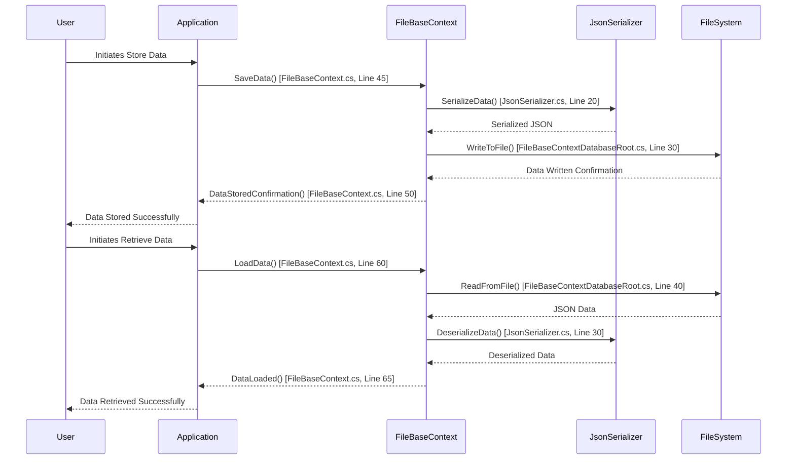

# Basic overview

```mermaid
sequenceDiagram
    participant User
    participant Application
    participant FileBaseContext
    participant JsonSerializer
    participant FileSystem

    User->>Application: Initiates Store Data
    Application->>FileBaseContext: SaveData() [FileBaseContext.cs, Line 45]
    FileBaseContext->>JsonSerializer: SerializeData() [JsonSerializer.cs, Line 20]
    JsonSerializer-->>FileBaseContext: Serialized JSON
    FileBaseContext->>FileSystem: WriteToFile() [FileBaseContextDatabaseRoot.cs, Line 30]
    FileSystem-->>FileBaseContext: Data Written Confirmation
    FileBaseContext-->>Application: DataStoredConfirmation() [FileBaseContext.cs, Line 50]
    Application-->>User: Data Stored Successfully

    User->>Application: Initiates Retrieve Data
    Application->>FileBaseContext: LoadData() [FileBaseContext.cs, Line 60]
    FileBaseContext->>FileSystem: ReadFromFile() [FileBaseContextDatabaseRoot.cs, Line 40]
    FileSystem-->>FileBaseContext: JSON Data
    FileBaseContext->>JsonSerializer: DeserializeData() [JsonSerializer.cs, Line 30]
    JsonSerializer-->>FileBaseContext: Deserialized Data
    FileBaseContext-->>Application: DataLoaded() [FileBaseContext.cs, Line 65]
    Application-->>User: Data Retrieved Successfully


```
